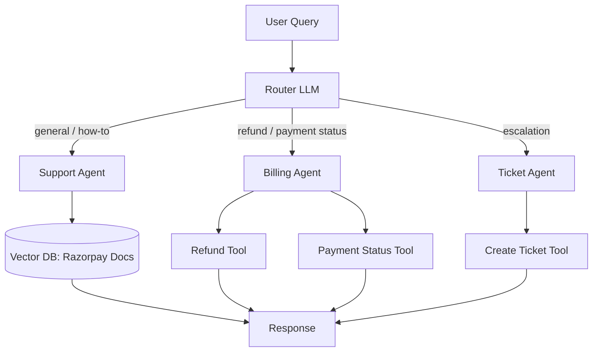

Live link-https://customer-support-multi-agent-meqjlmwqflz5kg97avgj3k.streamlit.app/

# Razorpay Customer Support Multi-Agent System

An agentic AI system that answers Razorpay documentation questions, processes refunds, checks payment status, and raises support tickets — powered by a router that delegates each query to the right specialized agent.

## Why this project

Most support workflows split across three separate needs: answering "how do I..." questions, handling billing actions, and escalating unresolved issues. This project models that split as three cooperating AI agents instead of one monolithic chatbot, so each agent stays focused and easy to reason about.

## Architecture



## Features

- **Retrieval-Augmented Generation (RAG):** 262 Razorpay documentation pages scraped, chunked, embedded, and stored in a Chroma vector database.
- **Multi-agent routing:** an LLM-based router classifies each query and hands it to the Support, Billing, or Ticket agent.
- **Tool-calling agents:** each agent decides on its own which tool to call, with no hardcoded if/else logic.
- **Conversation memory:** agents remember prior turns in the same session (e.g., recalling a ticket ID mentioned earlier).
- **Error handling:** malformed or incomplete requests are caught gracefully instead of crashing the app.
- **Streamlit chat UI:** a simple web interface for live demos.

## Tech Stack

| Layer | Tool |
|---|---|
| LLM | Groq (`openai/gpt-oss-20b`) |
| Agent framework | LangChain + LangGraph |
| Vector DB | ChromaDB |
| Embeddings | HuggingFace `all-MiniLM-L6-v2` |
| UI | Streamlit |
| Data source | Razorpay's public documentation |

## Project Structure

```
├── scraper.py        # Downloads Razorpay docs as markdown
├── ingest.py          # Chunks docs and builds the vector database
├── mock_api.py         # Simulated refund / payment status / ticket APIs
├── multi_agent.py       # Router + 3 specialized agents
├── app.py               # Streamlit chat interface
├── query.py              # Simple single-agent RAG script (early prototype)
├── agent.py                # Single-agent version (kept for comparison)
├── requirements.txt
└── .gitignore
```

## How It Works

1. **Data collection** — `scraper.py` pulls Razorpay's public docs (via their `llms.txt` index) as clean markdown files.
2. **Indexing** — `ingest.py` splits the docs into ~800-character chunks and stores their embeddings in ChromaDB.
3. **Routing** — when a user sends a message, a lightweight LLM call classifies it as `support`, `billing`, or `ticket`.
4. **Agent execution** — the matching agent (each with only the tools relevant to its role) picks the right tool, calls it, and responds.
5. **Memory** — the full conversation history is passed to each agent call so context carries across turns.

## Example Interactions

```
> how do I integrate the payment gateway
[Routed to: support agent]
→ Returns a step-by-step integration guide pulled from the docs.

> refund payment pay_abc123 for 500 rupees
[Routed to: billing agent]
→ Refund processed successfully. Refund ID: rfnd_477400

> check status of pay_999 and if it failed, create a ticket, email is sam@test.com
[Routed to: billing agent]
→ Checks status first; since it's "Pending" (not failed), no ticket is created — showing conditional reasoning, not a fixed script.
```

## Setup

```bash
# 1. Clone the repo
git clone https://github.com/divmishra476-bit/QueryForge.git
cd <project-folder>

# 2. Create a virtual environment
python -m venv venv
venv\Scripts\activate      # Windows
# source venv/bin/activate # Mac/Linux

# 3. Install dependencies
pip install -r requirements.txt

# 4. Add your Groq API key
echo GROQ_API_KEY=your_key_here > .env

# 5. Build the knowledge base
python scraper.py
python ingest.py

# 6. Run the app
streamlit run app.py
```

## Notes on Mock APIs

Real Razorpay account activation requires business KYC (PAN, bank details), which isn't practical for a portfolio project. `mock_api.py` simulates the refund, payment-status, and ticket-creation endpoints with the same interface a real integration would use — swapping in real Razorpay API calls later only requires changing this one file.

## Future Improvements

- Hybrid search (keyword + semantic) for more precise doc retrieval
- Multi-language support for non-English queries
- Deploy to Streamlit Cloud for a live public demo
- Swap mock APIs for real Razorpay test-mode API calls

## Author

Built by Divyam Mishra as a project to demonstrate agentic AI system design: multi-agent orchestration, RAG, tool-calling, and memory.
